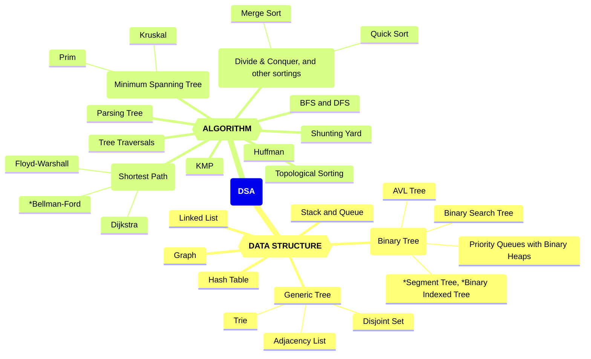
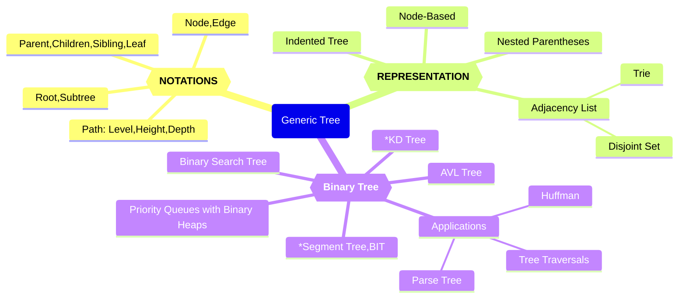
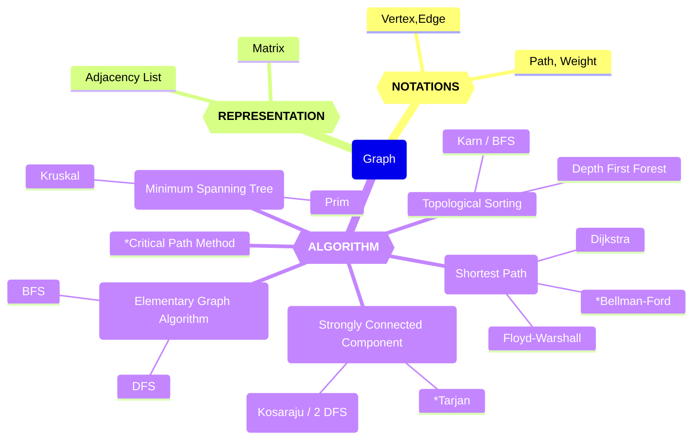

# 数据结构与算法知识体系（DSA）

Updated 2117 GMT+8 Jun 2, 2025

2025 spring, Complied by Hongfei Yan


> 我们考数算，尽量避免计概题目
>
> 建议适当降低笔试总分，同时考虑减少或取消算法填空题。鉴于机考环节已经对算法能力进行了考察，笔试中再设置此类题型略显重复，必要性不大。
>
> 机考时间：第16周周三上机，2025年6月4日 15:08-17:00, 在7、8号机房
> 笔试时间：周二，2025年6月17日 14:00-16:00
>
> 课程的总评规划如下：期末机考时长为 1 小时 52 分钟，共包含 6 道编程题。建议同学们力争在机考中取得 AC5 或 AC6 的成绩，以确保获得“优秀”评级；若仅达到 AC0，即使笔试成绩满分，总评最高也不超过 84 分。在不超出优秀率限制的前提下，AC4 的学生也有机会被评定为“优秀”。
>
> 
>
> 机考提示信息：
>
> 数据结构与算法（B）课程考试。
> 请独立完成，不能通讯，如：不能使用微信、邮件、QQ等工具。
> 考试期间，请同学只能访问OJ，不能访问其他网站，不能查看OJ考试之前自己提交的代码。
> 考试过程中允许可以带10张A4纸大小的cheat sheet，如记录语法信息作为参考。
> 题目编号前的英文字母大写表示题目的难度等级，分别对应 Easy、Medium 和 Tough。
>
> ————-
> 登录别人的账号即视为违纪甚至作弊。把自己的账号密码告诉别人，被别人登录，也视为违纪甚至作弊。如果考前别人用过你的账号，请立即修改密码。
> 请确保你的昵称格式为 24nxxxxx, 后面部分是学号。http://cs101.openjudge.cn/mine
> 有同学昵称22n, 21n, 20n, 19n开始也是可以的，学号别错，就能找到你的成绩。
>
> 

数据结构与算法（DSA，数算）的学习重点是树和图，及其涉及的各种核心算法。尽管栈和队列是基础的数据结构，且现代编程语言对其提供了直接支持，这使得我们可以方便地使用它们，但要真正掌握并高效利用这些结构，仍需深入理解其内部原理及适用场景。此外，其他一些复杂而强大的数据结构如并查集、前缀树等，同样值得我们去学习和探索。

一旦掌握了基本的数据结构（如数组、矩阵）和基础算法（包括递归、搜索、动态规划、贪心算法等），你会发现《数据结构与算法》这门课程变得更加容易理解。该课程主要探讨线性结构和非线性结构（如树和图）。其中：  

- **线性结构**可以视为数组概念的延伸，而数组本质上是一种隐式的链表。  
- **树**尤其是二叉树，通常使用递归来实现各种操作；并查集也是基于递归思想的应用，字典树（Trie）则可以通过嵌套字典（`dict{dict}`）来构建。  
- **图**作为矩阵概念的一种扩展，既可以通过二维数组表示矩阵来模拟，也可以用邻接表的形式（如`dict{list}`）来表示更复杂的图结构。

通过练习这些经典题目，可以帮助同步不同进度学生的学习步伐，还能有效提高解决实际问题的能力，并为进一步深入学习数据结构和算法提供必要的准备。  
例如，在《计算概论》阶段如果已经掌握了双指针技术，那么在《数据结构与算法》课程中遇到链表结构时，快慢指针的概念就会变得容易理解。同样地，掌握了递归思想后，并查集的实现也会更加直观。对于嵌套使用基本数据结构有了深入了解之后，构建字典树（Trie）以及图的表示方法（如邻接表dict{list}或邻接矩阵形式的二维数组）也将变得顺理成章。  
此外，搜索算法中的广度优先搜索（BFS）和深度优先搜索（DFS）是解决许多问题的基础。当你熟悉了BFS的应用场景后，将其应用于树结构中就成为了按层次遍历的有效工具。而一旦掌握了动态规划（DP），将这种思维方式扩展到树形结构上，即树形DP，也仅仅是遍历树的同时应用动态规划思想的过程。  
所以数算比计概简单，如果计概投入时间少，需要刷力扣热题100补足。https://leetcode.cn/studyplan/top-100-liked/  


<center>图1 数据结构与算法、计算概论课程内容覆盖知识点</center>


图1左侧为**数据结构**（Data Structure），右侧为**算法**（Algorithm），二者结合构成了 DSA 的核心内容。


## 一 、数据结构分类


### 1. 基础数据结构

- **栈（Stack）**：后进先出（LIFO），用于表达式求值、括号匹配等
- **队列（Queue）**：先进先出（FIFO）；包括双端队列（Deque）
- **哈希表（Hash Table / Dictionary / Map）**：常数时间插入/查询
- **链表（Linked List）**：单链表、双向链表、循环链表
- **数组（Array）**：支持随机访问
  - 前缀和 / 差分数组：用于区间求和/更新
- **字符串（String）**：特殊线性结构，支持哈希、匹配、变形等操作

---


### 2. 树结构

#### 🌳 通用树（General Tree）

- 节点、边、根、子树、父/子/兄弟节点、叶子节点
- 表示法：嵌套括号、缩进式、邻接表

#### 🌲 二叉树（Binary Tree）

- 遍历：先序、中序、后序、层序
- 常见树：
  - **解析树**（表达式计算）
  - **霍夫曼树**（最优前缀编码）
  - **优先队列**（基于堆实现）
  - **二叉搜索树（BST）**、AVL 自平衡树
  - *线段树（Segment Tree）
  - *树状数组（Fenwick Tree / Binary Indexed Tree）


---

### 3. 图结构（Graph）

- 顶点、边、路径、环、连通性、权重
- 表示方式：邻接矩阵、邻接表


---

## 二、 算法分类

### 1. 基础算法技巧

- 滑动窗口 & 双指针：子数组/子串枚举与优化
- 二分算法：查找 / 二分答案（最大化最小值 / 最小化最大值 ）
- 单调栈 & 单调队列：最近较大/较小元素、区间维护
- 辅助栈/队列：如最小栈、双栈实现队列
- 链表技巧：快慢指针


---

### 2. 经典算法思想

- 分治算法（Divide & Conquer）：快速排序、归并排序
- 动态规划（DP）：背包、树形、滚动数组优化用于压缩 DP 空间等
- 贪心算法：构造法、区间调度、反悔贪心
- 回溯与剪枝：组合、排列、子集、N 皇后、数独等
- 数学类：卡特兰数、同余等
- 表达式求值：
  - 调度场算法（Shunting Yard）
  - 逆波兰表达式（RPN）


---

### 3. 字符串算法

- KMP 算法：字符串匹配
- *Manacher 算法：最长回文子串
- 字符串哈希：双模哈希

---

### 4. 图论算法

- 图遍历：DFS / BFS（迷宫、连通块、染色等）
- 最短路径：
  - Dijkstra（贪心）
  - Bellman-Ford（可负权）
  - Floyd-Warshall（多源最短路径）
- 拓扑排序（DAG）
- 最小生成树：
  - Kruskal（并查集）、Prim（堆优化）
- 并查集（Union-Find）：路径压缩、连通性维护
- 强连通分量（SCC）：Kosaraju/ 2 DFS、*Tarjan


---

### 5. 树上算法

- LCA（最近公共祖先）：DFS + 递归（朴素法）
- 树的直径：DFS 
- 树上 DP


图2是数算内容汇总知识图谱。因为树、图的概念和相应算法较多，单独给出了树和图的知识图谱。

图3是树的知识图谱，描述了树的基本概念，到具体应用的各个方面。

图4是图的知识图谱，聚焦于图的基本概念、表示方法及其相关算法。

希望这种组织方式有助于清晰地理解各个知识点之间的关系，从而更加系统地学习数据结构与算法。




<center>图2 数算知识图谱</center>




<center>图3 树的知识图谱</center>




<center>图4 图的知识图谱</center>


我们班机考为主，`cs201数算 2025spring每日选做` 有161个题目（一半OJ题目，一半是力扣题目），https://github.com/GMyhf/2025spring-cs201/blob/main/problem_list_2025spring.md

准备分类总结；再就是结合这学期的课件；以及往年笔试题目。


## 三、课件

课件网址 https://github.com/，下面只列出考试范围内的课件，大语言模型相关课件也可以在线查阅。

20250304_week3_DSA_OOP.md	面向对象编程

20250311_week4-5_timeComplexity_linearStructure.md	时间复杂度、排序、线性结构

20250325_week6-9_tree.md	树

20250421_week10-13_graph.md	图

20250520_HashTable_KMP.md	散列表、KMP


在认真学习上面4个课件内容后，可以练习和完成每日选做题面。

<mark>problem_list_2025spring.md	每日选做题目</mark>

20250526_dsa_mindmap.md	数算知识体系（本文件）


两个主要的题解：

https://github.com/GMyhf/2024spring-cs201/blob/main/2024spring_dsa_problems.md

https://github.com/GMyhf/2024fall-cs101/blob/main/2024fall_LeetCode_problems.md


## 四、必须掌握题目

从每日选做中挑了一些重点需要掌握的题目如下。

| 问题编号与名称                   | 标签              | 难度   | 链接                                      |
| -------------------------------- | ----------------- | ------ | ----------------------------------------- |
| 04089:电话号码                   | Trie              | Medium | http://cs101.openjudge.cn/practice/04089/ |
| 20106:走山路                     | Dijkstra          | Medium | http://cs101.openjudge.cn/practice/20106/ |
| 09202: 舰队、海域出击！          | Topological Order | Medium | http://cs101.openjudge.cn/practice/09202/ |
| 05442: 兔子与星空                | MST               | Medium | http://cs101.openjudge.cn/practice/05442/ |
| 27635:判断无向图是否连通有无回路 | dfs, union-find   | Medium | http://cs101.openjudge.cn/practice/27635/ |
| 28046: 词梯                      | bfs               | Tough  | http://cs101.openjudge.cn/practice/28046/ |
| 04123: 马走日                    | backtracking      | Medium | http://cs101.openjudge.cn/practice/04123  |
| 02524: 宗教信仰                  | disjoint set      | Medium | http://cs101.openjudge.cn/practice/02524/ |
| 04078: 实现堆结构                | heap              | Medium | http://cs101.openjudge.cn/practice/04078/ |
| 22158: 根据二叉树前中序序列建树  | tree              | Medium | http://cs101.openjudge.cn/practice/22158/ |
| 24750: 根据二叉树中后序序列建树  | tree              | Medium | http://cs101.openjudge.cn/practice/24750/ |
| 24591:中序表达式转后序表达式     | stack             | Tough  | http://cs101.openjudge.cn/practice/24591/ |
| 03704: 括号匹配问题              | stack             | Easy   | http://cs101.openjudge.cn/practice/03704  |
| 02299: Ultra-QuickSort           | 归并排序          | Tough  | http://cs101.openjudge.cn/practice/02299/ |
| 08210:河中跳房子                 | Binary search     | Medium | http://cs101.openjudge.cn/practice/08210  |
| 27256: 当前队列中位数            | data structures   | Tough  | http://cs101.openjudge.cn/practice/27256/ |


## 五、每日选做题目

课件网址 https://github.com/

Q：材料`problem_list_2025spring.md`是这学期课程内容覆盖到的题目，有各个题目的名称、标签、难度和链接。需要结合题解`2024spring_dsa_problems`，`2024fall_LeetCode_problems.md`来找题面和代码。 

将`problem_list_2025spring.md`中的题目，按照 “问题编号与名称“ 在`2024spring_dsa_problems`，或者`2024fall_LeetCode_problems.md` 中可以找到题目的题面，及相应的 AC代码等信息。

对于`problem_list_2025spring.md`中每个标签，遍历的所有161个题目，然后收集题号、名称、链接，给出对应题目简短1-2句的题面要求，及解题思路。


> AI分类不出来，还得人工来

### 拓扑排序
01094: Sorting It All Out,  http://cs101.openjudge.cn/practice/01094/

- 题面：给定n个大写字母和m个"A<B"形式的关系，判断是否能确定唯一排序序列，或发现矛盾  
- 思路：增量式拓扑排序，每次添加关系后检测入度变化，若存在多个入度0节点则序列不唯一，出现环则矛盾

**T1857.有向图中最大颜色值**，  https://leetcode.cn/problems/largest-color-value-in-a-directed-graph/

- 题面：在有向图中寻找路径使得节点颜色出现次数最大值最大  
- 思路：拓扑排序+动态规划，维护每个节点各颜色出现次数的最大值

```python
from collections import deque
from typing import List

class Solution:
    def largestPathValue(self, colors: str, edges: List[List[int]]) -> int:
        n = len(colors)
        # 1. 构建图与入度
        g = [[] for _ in range(n)]
        indeg = [0] * n
        for u, v in edges:
            g[u].append(v)
            indeg[v] += 1

        # 2. 初始化 DP 表
        # dp[u][c] = 在以 u 结尾的路径中，颜色 c 出现的最大次数
        dp = [[0] * 26 for _ in range(n)]
        for u, ch in enumerate(colors):
            dp[u][ord(ch) - ord('a')] = 1

        # 3. 拓扑排序
        q = deque(u for u in range(n) if indeg[u] == 0)
        visited = 0
        ans = 0

        while q:
            u = q.popleft()
            visited += 1
            # 更新全局最优
            ans = max(ans, max(dp[u]))
            for v in g[u]:
                # 对 v 的每一种颜色尝试松弛
                for c in range(26):
                    # 如果 v 的颜色恰好是 c，则要 +1，否则不加
                    dp[v][c] = max(dp[v][c], dp[u][c] + (ord(colors[v]) - ord('a') == c))
                indeg[v] -= 1
                if indeg[v] == 0:
                    q.append(v)

        # 4. 如果没遍历完所有节点，说明存在环
        if visited < n:
            return -1

        return ans
```


210.课程表II， https://leetcode.cn/problems/course-schedule-ii/description/

22508:最小奖金方案， http://cs101.openjudge.cn/practice/22508/

09202: 舰队、海域出击！http://cs101.openjudge.cn/2025sp_routine/09202/

207.课程表，https://leetcode.cn/problems/course-schedule/


### 动态规划DP
**M337.打家劫舍III**，

树形dp, https://leetcode.cn/problems/house-robber-iii/description/

- 题面：在二叉树中选择不相邻节点求最大和  
- 思路：树形DP，记录每个节点偷/不偷两种状态的最大值

```python
# Definition for a binary tree node.
# class TreeNode:
#     def __init__(self, val=0, left=None, right=None):
#         self.val = val
#         self.left = left
#         self.right = right
class Solution:
    def rob(self, root: Optional[TreeNode]) -> int:
        def dfs(node):
            if node is None:
                return 0,0

            l_rob, l_not_rob = dfs(node.left)
            r_rob, r_not_rob = dfs(node.right)
            choose = node.val + l_not_rob + r_not_rob
            not_choose = max(l_rob, l_not_rob) + max(r_rob, r_not_rob)
        
            return choose, not_choose
        
        return max(dfs(root))
```


24637:宝藏二叉树， 

树形dp, http://cs101.openjudge.cn/2025sp_routine/24637/


45.跳跃游戏II, https://leetcode.cn/problems/jump-game-ii/

01159: Palindrome， http://cs101.openjudge.cn/2025sp_routine/01159/

**M542.01 矩阵，**

bfs, dp, https://leetcode-cn.com/problems/01-matrix/

给定一个由 `0` 和 `1` 组成的矩阵 `mat` ，请输出一个大小相同的矩阵，其中每一个格子是 `mat` 中对应位置元素到最近的 `0` 的距离。

两个相邻元素间的距离为 `1` 。

 

**示例 1：**


```
输入：mat = [[0,0,0],[0,1,0],[0,0,0]]
输出：[[0,0,0],[0,1,0],[0,0,0]]
```

**示例 2：**


```
输入：mat = [[0,0,0],[0,1,0],[1,1,1]]
输出：[[0,0,0],[0,1,0],[1,2,1]]
```

 

**提示：**

- `m == mat.length`
- `n == mat[i].length`
- `1 <= m, n <= 10^4`
- `1 <= m * n <= 10^4`
- `mat[i][j] is either 0 or 1.`
- `mat` 中至少有一个 `0 `

 

124ms，击败64.56%

```python
from typing import List
from collections import deque

class Solution:
    def updateMatrix(self, mat: List[List[int]]) -> List[List[int]]:
        m, n = len(mat), len(mat[0])
        dp = [[float('inf')] * n for _ in range(m)]
        queue = deque()

        # 初始化，把所有 0 加入队列，结构为 (dist, i, j)
        for i in range(m):
            for j in range(n):
                if mat[i][j] == 0:
                    dp[i][j] = 0
                    queue.append((0, i, j))  # 明确带 dist，便于调试、阅读

        directions = [(-1,0), (1,0), (0,-1), (0,1)]

        while queue:
            dist, x, y = queue.popleft()

            # 如果当前距离比 dp 更大，说明已被更新（可选的剪枝）
            if dist > dp[x][y]:
                continue

            for dx, dy in directions:
                nx, ny = x + dx, y + dy
                if 0 <= nx < m and 0 <= ny < n:
                    if dp[nx][ny] > dist + 1:
                        dp[nx][ny] = dist + 1
                        queue.append((dp[nx][ny], nx, ny))  

        return dp

# 测试
if __name__ == "__main__":
    mat = [[0,0,0],[0,1,0],[1,1,1]]
    for row in Solution().updateMatrix(mat):
        print(row)

```


是 OJ01088:滑雪 的升级版。因为矩阵每个点的高度有更新，不能只用sort一次，需要使用heapq。

当路径代价不同、更新存在“早晚优先级”时，用堆有优势。否则 BFS 更快。

207ms，击败19.49%

```python
import heapq
from typing import List

class Solution:
    def updateMatrix(self, mat: List[List[int]]) -> List[List[int]]:
        m, n = len(mat), len(mat[0])
        dp = [[float('inf')] * n for _ in range(m)]
        heap = []

        # 初始化，所有的0加入到堆中
        for i in range(m):
            for j in range(n):
                if mat[i][j] == 0:
                    dp[i][j] = 0
                    heapq.heappush(heap, (0, i, j))  # (distance, x, y)

        # 定义四个方向的移动
        directions = [(0, 1), (0, -1), (1, 0), (-1, 0)]

        # 使用堆进行更新
        while heap:
            dist, x, y = heapq.heappop(heap)

            # 如果当前的距离大于 dp[x][y]，说明这个位置已经被更新过，不需要再次处理
            if dist > dp[x][y]:
                continue

            # 对当前点的四个方向进行处理
            for dx, dy in directions:
                nx, ny = x + dx, y + dy
                if 0 <= nx < m and 0 <= ny < n:
                    # 如果新位置的dp值可以更新（即发现更短的路径）
                    if dp[nx][ny] > dp[x][y] + 1:
                        dp[nx][ny] = dp[x][y] + 1
                        heapq.heappush(heap, (dp[nx][ny], nx, ny))

        return dp

# 测试用例
if __name__ == "__main__":
    mat = [[0,0,0],[0,1,0],[1,1,1]]
    print(Solution().updateMatrix(mat))
```


01088: 滑雪，http://cs101.openjudge.cn/2025sp_routine/01088

121.买卖股票的最佳时机，https://leetcode.cn/problems/best-time-to-buy-and-sell-stock/

5.最长回文子串

dp, two pointers, Manacher，https://leetcode.cn/problems/longest-palindromic-substring/

1299.将每个元素替换为右侧最大元素，https://leetcode.cn/problems/replace-elements-with-greatest-element-on-right-side/


### 滑动窗口sliding window

**M3556.最大质数子字符串之和，**https://leetcode.cn/problems/sum-of-largest-prime-substrings/description/

给定一个字符串 `s`，找出可以由其 **子字符串** 组成的 **3个最大的不同质数** 的和。

返回这些质数的 **总和** ，如果少于 3 个不同的质数，则返回 **所有** 不同质数的和。

质数是大于 1 且只有两个因数的自然数：1和它本身。

**子字符串** 是字符串中的一个连续字符序列。 

**注意：**每个质数即使出现在 **多个** 子字符串中，也只能计算 **一次** 。此外，将子字符串转换为整数时，忽略任何前导零。

 

**示例 1：**

**输入：** s = "12234"

**输出：** 1469

**解释：**

- 由 `"12234"` 的子字符串形成的不同质数为 2 ，3 ，23 ，223 和 1223。
- 最大的 3 个质数是 1223、223 和 23。它们的和是 1469。

**示例 2：**

**输入：** s = "111"

**输出：** 11

**解释：**

- 由 `"111"` 的子字符串形成的不同质数是 11。
- 由于只有一个质数，所以结果是 11。

 

**提示：**

- `1 <= s.length <= 10`
- `s` 仅由数字组成。


```python
class Solution:
    def sumOfLargestPrimes(self, s: str) -> int:
        def is_prime(n: int) -> bool:
            if n < 2:
                return False
            for i in range(2, int(n**0.5) + 1):
                if n % i == 0:
                    return False
            return True

        primes = set()
        for left in range(len(s)):
            num = int(s[left])
            if is_prime(num):
                primes.add(num)
            for right in range(left + 1, len(s)):
                num = int(s[left:right + 1])

                if is_prime(num):
                    primes.add(num)

        primes = list(primes)
        primes.sort(reverse=True)

        return sum(primes[:3]) if len(primes) > 2 else sum(primes)

if __name__ == "__main__":
    sol = Solution()
    print(sol.sumOfLargestPrimes("12234"))
    print(sol.sumOfLargestPrimes("111"))
```


2962.统计最大元素出现至少K次的子数组，https://leetcode.cn/problems/count-subarrays-where-max-element-appears-at-least-k-times/

2799.统计完全子数组的数目，https://leetcode.cn/problems/count-complete-subarrays-in-an-array/


### 单调栈Monotonic Stack

**T84.柱状图中最大的矩形，**https://leetcode.cn/problems/largest-rectangle-in-histogram/

给定 *n* 个非负整数，用来表示柱状图中各个柱子的高度。每个柱子彼此相邻，且宽度为 1 。

求在该柱状图中，能够勾勒出来的矩形的最大面积。

 

**示例 1:**


```
输入：heights = [2,1,5,6,2,3]
输出：10
解释：最大的矩形为图中红色区域，面积为 10
```

**示例 2：**


```
输入： heights = [2,4]
输出： 4
```

 

**提示：**

- `1 <= heights.length <=10^5`
- `0 <= heights[i] <= 10^4`


```python
from typing import List
class Solution:
    def largestRectangleArea(self, heights: List[int]) -> int:
        stack = []
        heights = [0] + heights + [0]
        res = 0
        for i in range(len(heights)):
            while stack and heights[i] < heights[stack[-1]]:
                h = heights[stack.pop()]
                w = i - stack[-1] - 1
                res = max(res, h * w)
            stack.append(i)
        return res

if __name__ == '__main__':
    s = Solution()
    print(s.largestRectangleArea([2,1,5,6,2,3]))
```

关键概念：

1. **单调栈**：
   - <mark>用栈来维护柱子的索引，并确保栈中的柱子高度是单调递增的。</mark>
   - 当遇到比栈顶柱子矮的柱子时，就意味着栈顶的柱子已经不能再扩展更大的矩形了，应该从栈中弹出这个柱子，计算以它为高度的矩形面积。
2. **为什么需要在 `heights` 前后加 0**：
   - 通过在 `heights` 数组的开始和结束分别加上 `0`，可以保证栈最终能清空，并且在所有柱子处理完后能够强制计算出最后一块矩形面积。
   - 这个“0”是为了处理栈中剩余的柱子（特别是最后一部分）。

栈操作：

- **栈中存储的是什么**：
  - `stack` 中存储的是柱子的 **索引**，而不是柱子的高度。这样可以通过 `heights[i]` 直接访问到柱子的高度。
- **计算矩形面积**：
  - 在栈顶元素出栈时，表示栈顶柱子所能组成的最大矩形已经结束，当前的矩形高度就是栈顶柱子的高度。
  - 宽度 `w` 的计算是当前索引 `i` 减去栈中的下一个元素索引（即 `stack[-1]`），再减去 1，因为栈中的元素代表了一个 **区间**。
  - 例如，如果 `stack[-1]` 是索引 `j`，那么这个矩形的宽度就是 `i - j - 1`。


### KMP

T01961: 前缀中的周期，http://cs101.openjudge.cn/2025sp_routine/01961/

题意：给定一个长度为N的字符串S，对S的每一个前缀S[1~i]，如果它的最大循环次数大于1，则输出该前缀的长度和最大循环次数。

```python
'''
这是一个字符串匹配问题，通常使用KMP算法（Knuth-Morris-Pratt算法）来解决。
使用了 Knuth-Morris-Pratt 算法来寻找字符串的所有前缀，并检查它们是否由重复的子串组成，
如果是的话，就打印出前缀的长度和最大重复次数。
'''

# 得到字符串s的前缀值列表
def kmp_next(s):
  	# kmp算法计算最长相等前后缀
    next = [0] * len(s)
    j = 0
    for i in range(1, len(s)):
        while s[i] != s[j] and j > 0:
            j = next[j - 1]
        if s[i] == s[j]:
            j += 1
        next[i] = j
    return next


def main():
    case = 0
    while True:
        n = int(input().strip())
        if n == 0:
            break
        s = input().strip()
        case += 1
        print("Test case #{}".format(case))
        next = kmp_next(s)
        for i in range(2, len(s) + 1):
            k = i - next[i - 1]		# 可能的重复子串的长度
            if (i % k == 0) and i // k > 1:
                print(i, i // k)
        print()


if __name__ == "__main__":
    main()
```


### 栈Stack

3561.移除相邻字符，https://leetcode.cn/problems/resulting-string-after-adjacent-removals/

**T24591:中序表达式转后序表达式**，http://cs101.openjudge.cn/practice/24591/

<mark>Shunting Yard 算法的主要思想是使用两个栈（运算符栈和输出栈）来处理表达式的符号</mark>。算法按照运算符的优先级和结合性，将符号逐个处理并放置到正确的位置。最终，输出栈中的元素就是转换后的后缀表达式。

以下是 Shunting Yard 算法的基本步骤：

1. 初始化运算符栈和输出栈为空。
2. 从左到右遍历中缀表达式的每个符号。
   - 如果是操作数（数字），则将其添加到输出栈。
   - 如果是左括号，则将其推入运算符栈。
   - 如果是运算符：
     - 如果运算符的优先级大于运算符栈顶的运算符，或者运算符栈顶是左括号，则将当前运算符推入运算符栈。
     - 否则，将运算符栈顶的运算符弹出并添加到输出栈中，直到满足上述条件（或者运算符栈为空）。
     - 将当前运算符推入运算符栈。
   - 如果是右括号，则将运算符栈顶的运算符弹出并添加到输出栈中，直到遇到左括号。将左括号弹出但不添加到输出栈中。
3. 如果还有剩余的运算符在运算符栈中，将它们依次弹出并添加到输出栈中。
4. 输出栈中的元素就是转换后的后缀表达式。


<mark>接收浮点数，是number buffer技巧。</mark>

```python
def infix_to_postfix(expression):
    precedence = {'+':1, '-':1, '*':2, '/':2}
    stack = []
    postfix = []
    number = ''

    for char in expression:
        if char.isnumeric() or char == '.':
            number += char
        else:
            if number:
                num = float(number)
                postfix.append(int(num) if num.is_integer() else num)
                number = ''
            if char in '+-*/':
                while stack and stack[-1] in '+-*/' and precedence[char] <= precedence[stack[-1]]:
                    postfix.append(stack.pop())
                stack.append(char)
            elif char == '(':
                stack.append(char)
            elif char == ')':
                while stack and stack[-1] != '(':
                    postfix.append(stack.pop())
                stack.pop()

    if number:
        num = float(number)
        postfix.append(int(num) if num.is_integer() else num)

    while stack:
        postfix.append(stack.pop())

    return ' '.join(str(x) for x in postfix)

n = int(input())
for _ in range(n):
    expression = input()
    print(infix_to_postfix(expression))
```


接收数据，还可以用<mark>re处理</mark>。

```python
# 24591:中序表达式转后序表达式
# http://cs101.openjudge.cn/practice/24591/

def inp(s):
    #s=input().strip()
    import re
    s=re.split(r'([\(\)\+\-\*\/])',s)
    s=[item for item in s if item.strip()]
    return s

exp = "(3)*((3+4)*(2+3.5)/(4+5)) "
print(inp(exp))
```


sy295: 可能的出栈序列，https://sunnywhy.com/sfbj/7/1/295

22068:合法出栈序列，http://cs101.openjudge.cn/practice/22068/

02734: 十进制到八进制，http://cs101.openjudge.cn/2025sp_routine/02734/

02694:波兰表达式，http://cs101.openjudge.cn/2025sp_routine/02694/

150.逆波兰表达式求值，https://leetcode.cn/problems/evaluate-reverse-polish-notation/

20140:今日化学论文，http://cs101.openjudge.cn/2025sp_routine/20140/

03704:扩号匹配问题，http://cs101.openjudge.cn/2025sp_routine/03704/

394.字符串解码，https://leetcode.cn/problems/decode-string/


### 辅助栈

M155.最小栈，https://leetcode.cn/problems/min-stack/

OOP，辅助栈, https://leetcode.cn/problems/min-stack/

设计一个支持 `push` ，`pop` ，`top` 操作，并能在<mark>常数时间内检索到最小元素的栈</mark>。

实现 `MinStack` 类:

- `MinStack()` 初始化堆栈对象。
- `void push(int val)` 将元素val推入堆栈。
- `void pop()` 删除堆栈顶部的元素。
- `int top()` 获取堆栈顶部的元素。
- `int getMin()` 获取堆栈中的最小元素。

 

**示例 1:**

```
输入：
["MinStack","push","push","push","getMin","pop","top","getMin"]
[[],[-2],[0],[-3],[],[],[],[]]

输出：
[null,null,null,null,-3,null,0,-2]

解释：
MinStack minStack = new MinStack();
minStack.push(-2);
minStack.push(0);
minStack.push(-3);
minStack.getMin();   --> 返回 -3.
minStack.pop();
minStack.top();      --> 返回 0.
minStack.getMin();   --> 返回 -2.
```

 

**提示：**

- `-2^31 <= val <= 2^31 - 1`
- `pop`、`top` 和 `getMin` 操作总是在 **非空栈** 上调用
- `push`, `pop`, `top`, and `getMin`最多被调用 `3 * 10^4` 次


```python
class MinStack:

    def __init__(self):
        self.stack = []
        self.min_stack = []

    def push(self, val: int) -> None:
        self.stack.append(val)
        if not self.min_stack or val <= self.min_stack[-1]:
            self.min_stack.append(val)

    def pop(self) -> None:
        if self.stack:
            if self.stack[-1] == self.min_stack[-1]:
                self.min_stack.pop()
            self.stack.pop()

    def top(self) -> int:
        if self.stack:
            return self.stack[-1]

    def getMin(self) -> int:
        if self.min_stack:
            return self.min_stack[-1]

# Your MinStack object will be instantiated and called as such:
# obj = MinStack()
# obj.push(val)
# obj.pop()
# param_3 = obj.top()
# param_4 = obj.getMin()
```


### 队列queue

**E04067:回文数字**，http://cs101.openjudge.cn/2025sp_routine/04067/

```python
from collections import deque

def is_palindrome(num):
    num_str = str(num)
    num_deque = deque(num_str)
    while len(num_deque) > 1:
        if num_deque.popleft() != num_deque.pop():
            return "NO"
    return "YES"

while True:
    try:
        num = int(input())
        print(is_palindrome(num))
    except EOFError:
        break
```


### 矩阵matrices

02659: Bomb Game, http://cs101.openjudge.cn/practice/02659/

18161:矩阵运算(先乘再加)，http://cs101.openjudge.cn/2025sp_routine/18161/

**M48.旋转图像**，https://leetcode.cn/problems/rotate-image/

给定一个 *n* × *n* 的二维矩阵 `matrix` 表示一个图像。请你将图像顺时针旋转 90 度。

你必须在**[ 原地](https://baike.baidu.com/item/原地算法)** 旋转图像，这意味着你需要直接修改输入的二维矩阵。**请不要** 使用另一个矩阵来旋转图像。

 

**示例 1：**


```
输入：matrix = [[1,2,3],[4,5,6],[7,8,9]]
输出：[[7,4,1],[8,5,2],[9,6,3]]
```

**示例 2：**


```
输入：matrix = [[5,1,9,11],[2,4,8,10],[13,3,6,7],[15,14,12,16]]
输出：[[15,13,2,5],[14,3,4,1],[12,6,8,9],[16,7,10,11]]
```

 

**提示：**

- `n == matrix.length == matrix[i].length`
- `1 <= n <= 20`
- `-1000 <= matrix[i][j] <= 1000`


```python
class Solution:
    def rotate(self, matrix: List[List[int]]) -> None:
        """
        Do not return anything, modify matrix in-place instead.
        """
        n = len(matrix)
        for i in range(n):  # 先转置矩阵
            for j in range(i, n):
                matrix[i][j], matrix[j][i] = matrix[j][i], matrix[i][j]
        for i in range(n):  # 再水平翻转矩阵
            matrix[i].reverse()
```


**M2906.构造乘积矩阵**

matrices, prefix sum，https://leetcode.cn/problems/construct-product-matrix/

给你一个下标从 **0** 开始、大小为 `n * m` 的二维整数矩阵 `grid` ，定义一个下标从 **0** 开始、大小为 `n * m` 的的二维矩阵 `p`。如果满足以下条件，则称 `p` 为 `grid` 的 **乘积矩阵** ：

- 对于每个元素 `p[i][j]` ，它的值等于除了 `grid[i][j]` 外所有元素的乘积。乘积对 `12345` 取余数。

返回 `grid` 的乘积矩阵。

 

**示例 1：**

```
输入：grid = [[1,2],[3,4]]
输出：[[24,12],[8,6]]
解释：p[0][0] = grid[0][1] * grid[1][0] * grid[1][1] = 2 * 3 * 4 = 24
p[0][1] = grid[0][0] * grid[1][0] * grid[1][1] = 1 * 3 * 4 = 12
p[1][0] = grid[0][0] * grid[0][1] * grid[1][1] = 1 * 2 * 4 = 8
p[1][1] = grid[0][0] * grid[0][1] * grid[1][0] = 1 * 2 * 3 = 6
所以答案是 [[24,12],[8,6]] 。
```

**示例 2：**

```
输入：grid = [[12345],[2],[1]]
输出：[[2],[0],[0]]
解释：p[0][0] = grid[0][1] * grid[0][2] = 2 * 1 = 2
p[0][1] = grid[0][0] * grid[0][2] = 12345 * 1 = 12345. 12345 % 12345 = 0 ，所以 p[0][1] = 0
p[0][2] = grid[0][0] * grid[0][1] = 12345 * 2 = 24690. 24690 % 12345 = 0 ，所以 p[0][2] = 0
所以答案是 [[2],[0],[0]] 。
```

 

**提示：**

- `1 <= n == grid.length <= 10^5`
- `1 <= m == grid[i].length <= 10^5`
- `2 <= n * m <= 10^5`
- `1 <= grid[i][j] <= 10^9`


思路是先将二维矩阵拉平成一维数组，然后利用前缀与后缀乘积数组计算出每个位置除去当前值外所有元素的乘积，最后再还原为二维矩阵。注意计算均在模 12345 意义下进行。

```python
from typing import List

class Solution:
    def constructProductMatrix(self, grid: List[List[int]]) -> List[List[int]]:
        mod = 12345
        n = len(grid)
        m = len(grid[0])
        N = n * m
        # 将二维矩阵展平成一维数组
        arr = []
        for row in grid:
            arr.extend(row)

        # 计算前缀乘积数组
        prefix = [0] * N
        prefix[0] = arr[0] % mod
        for i in range(1, N):
            prefix[i] = (prefix[i - 1] * arr[i]) % mod

        # 计算后缀乘积数组
        suffix = [0] * N
        suffix[-1] = arr[-1] % mod
        for i in range(N - 2, -1, -1):
            suffix[i] = (suffix[i + 1] * arr[i]) % mod

        # 计算结果数组：对于位置 i, 结果为 (前缀[i-1] * 后缀[i+1]) % mod
        res = [0] * N
        for i in range(N):
            left = prefix[i - 1] if i > 0 else 1
            right = suffix[i + 1] if i < N - 1 else 1
            res[i] = (left * right) % mod

        # 将结果数组还原成 n*m 的矩阵
        ans = []
        idx = 0
        for i in range(n):
            row = []
            for j in range(m):
                row.append(res[idx])
                idx += 1
            ans.append(row)
        return ans

if __name__ == "__main__":
    sol = Solution()
    grid1 = [[1, 2], [3, 4]]
    grid2 = [[12345], [2], [1]]
    print(sol.constructProductMatrix(grid1))  # Expected output: [[24, 12], [8, 6]]
    print(sol.constructProductMatrix(grid2))  # Expected output: [[2], [0], [0]]

```

**说明**

- **思路：**  
  将二维矩阵拉平成一维数组后，可以用前缀和后缀乘积分别保存当前位置之前和之后所有元素的乘积。对于位置 `i`，其答案就是前缀乘积（不包括当前值）与后缀乘积（不包括当前值）的乘积，最后再取模 12345。
- **时间复杂度：**  
  整个过程只需对所有元素进行几次遍历，时间复杂度为 O(n*m)（最多 10^5 个元素）。
- **注意事项：**  
  由于模数 12345 不是质数，因此不能直接使用全局乘积再除去当前值（利用模逆元）来计算答案。使用前缀后缀数组可以避免除法问题。


### 宽搜BFS

**T1298.你能从盒子里获得的最大糖果数**

set, bfs, https://leetcode.cn/problems/maximum-candies-you-can-get-from-boxes/)

给你 `n` 个盒子，每个盒子的格式为 `[status, candies, keys, containedBoxes]` ，其中：

- 状态字 `status[i]`：整数，如果 `box[i]` 是开的，那么是 **1** ，否则是 **0** 。
- 糖果数 `candies[i]`: 整数，表示 `box[i]` 中糖果的数目。
- 钥匙 `keys[i]`：数组，表示你打开 `box[i]` 后，可以得到一些盒子的钥匙，每个元素分别为该钥匙对应盒子的下标。
- 内含的盒子 `containedBoxes[i]`：整数，表示放在 `box[i]` 里的盒子所对应的下标。

给你一个 `initialBoxes` 数组，表示你现在得到的盒子，你可以获得里面的糖果，也可以用盒子里的钥匙打开新的盒子，还可以继续探索从这个盒子里找到的其他盒子。

请你按照上述规则，返回可以获得糖果的 **最大数目** 。

 

**示例 1：**

```
输入：status = [1,0,1,0], candies = [7,5,4,100], keys = [[],[],[1],[]], containedBoxes = [[1,2],[3],[],[]], initialBoxes = [0]
输出：16
解释：
一开始你有盒子 0 。你将获得它里面的 7 个糖果和盒子 1 和 2。
盒子 1 目前状态是关闭的，而且你还没有对应它的钥匙。所以你将会打开盒子 2 ，并得到里面的 4 个糖果和盒子 1 的钥匙。
在盒子 1 中，你会获得 5 个糖果和盒子 3 ，但是你没法获得盒子 3 的钥匙所以盒子 3 会保持关闭状态。
你总共可以获得的糖果数目 = 7 + 4 + 5 = 16 个。
```

**示例 2：**

```
输入：status = [1,0,0,0,0,0], candies = [1,1,1,1,1,1], keys = [[1,2,3,4,5],[],[],[],[],[]], containedBoxes = [[1,2,3,4,5],[],[],[],[],[]], initialBoxes = [0]
输出：6
解释：
你一开始拥有盒子 0 。打开它你可以找到盒子 1,2,3,4,5 和它们对应的钥匙。
打开这些盒子，你将获得所有盒子的糖果，所以总糖果数为 6 个。
```

**示例 3：**

```
输入：status = [1,1,1], candies = [100,1,100], keys = [[],[0,2],[]], containedBoxes = [[],[],[]], initialBoxes = [1]
输出：1
```

**示例 4：**

```
输入：status = [1], candies = [100], keys = [[]], containedBoxes = [[]], initialBoxes = []
输出：0
```

**示例 5：**

```
输入：status = [1,1,1], candies = [2,3,2], keys = [[],[],[]], containedBoxes = [[],[],[]], initialBoxes = [2,1,0]
输出：7
```

 

**提示：**

- `1 <= status.length <= 1000`
- `status.length == candies.length == keys.length == containedBoxes.length == n`
- `status[i]` 要么是 `0` 要么是 `1` 。
- `1 <= candies[i] <= 1000`
- `0 <= keys[i].length <= status.length`
- `0 <= keys[i][j] < status.length`
- `keys[i]` 中的值都是互不相同的。
- `0 <= containedBoxes[i].length <= status.length`
- `0 <= containedBoxes[i][j] < status.length`
- `containedBoxes[i]` 中的值都是互不相同的。
- 每个盒子最多被一个盒子包含。
- `0 <= initialBoxes.length <= status.length`
- `0 <= initialBoxes[i] < status.length`


下面给出一种常见的做法：维护三个集合——“手上有的盒子”、“已经拿到的钥匙”和“已经打开过的盒子”，反复扫描能打开的盒子，不断收集糖果、钥匙和新盒子，直到无法再打开为止。

------

思路

1. **初始化**

   - `haveBoxes = set(initialBoxes)`：表示当前手上已经拿到（但未必能打开）的盒子。
   - `haveKeys = set()`：表示当前已经获得的钥匙（对应可打开的盒子编号）。
   - `opened = set()`：表示已经打开过的盒子（避免重复打开）。
   - `ans = 0`：统计已经收集的糖果总数。

2. **反复“松弛”**
   我们不断尝试去打开 `haveBoxes` 中的盒子，如果该盒子满足 **状态是开的（status[i] == 1）或者我们已经有这个盒子的钥匙（i ∈ haveKeys）**，并且还没被打开（i ∉ opened），就可以打开它：

   - 把 `opened.add(i)`。
   - 把 `candies[i]` 加到 `ans`。
   - 把打开盒子后获得的所有钥匙 `keys[i]` 加入 `haveKeys`。
   - 把盒子里包含的所有子盒子 `containedBoxes[i]` 加入 `haveBoxes`。

   每次只要至少打开了一个新盒子，就说明我们的“信息”（钥匙/新盒子）进一步扩展，我们还可以继续尝试打开新的盒子；如果一次循环里没有任何新盒子能被打开，就说明再也无法获得更多的糖果，可以结束。

3. **复杂度**

   - 外层循环（反复扫描所有“手上有”的盒子）最糟糕会执行 O(n) 次，每次内部最坏扫描 O(n) 个盒子，总体 O(n²)。
   - 由于 `n ≤ 1000`，这种做法是可以接受的。

------

代码实现

```python
from typing import List

class Solution:
    def maxCandies(self, status: List[int], 
                   candies: List[int], 
                   keys: List[List[int]], 
                   containedBoxes: List[List[int]], 
                   initialBoxes: List[int]) -> int:
        # 已拿到的盒子
        haveBoxes = set(initialBoxes)
        # 已拿到的钥匙
        haveKeys = set()
        # 已经打开过的盒子
        opened = set()
        # 总糖果数
        ans = 0
        
        # 只要每一轮还能打开至少一个新盒子，就继续循环
        while True:
            opened_this_round = False
            
            # 尝试遍历“手上有”的所有盒子
            for b in list(haveBoxes):
                # 如果这个盒子还没打开，并且是开着的 或者 我们有它的钥匙
                if b not in opened and (status[b] == 1 or b in haveKeys):
                    # 打开它
                    opened.add(b)
                    opened_this_round = True
                    # 收糖果
                    ans += candies[b]
                    # 拿到钥匙
                    for k in keys[b]:
                        haveKeys.add(k)
                    # 拿到子盒子
                    for nb in containedBoxes[b]:
                        haveBoxes.add(nb)
            
            # 如果这一轮没有打开任何新盒子，就可以结束
            if not opened_this_round:
                break
        
        return ans
```

解释要点

- **`haveBoxes`**：存放“已经在手上，但尚未（必然）打开”的盒子。
- **`haveKeys`**：存放“已经拿到的钥匙”，一旦钥匙里包含某个盒子的编号，就意味着无论该盒子原本是“关的”还是“开着的”，我们都能把它打开。
- **外层 `while True`**：之所以要反复循环，是因为：拿到新钥匙之后，可能让之前“拿到但因没有钥匙而没法打开”的某个盒子瞬间变为“可打开”；同样，打开一个盒子后拿到的新盒子也可能本身就是“开着的”，可以下轮打开。只有当**一整轮下来都没有任何新盒子被打开**，才说明剩余的盒子都无法继续打开，此时退出循环。
- **跳出条件**：`opened_this_round=False`，说明这一轮没有成功打开任何新盒子，就可以结束搜索，返回当前累加的 `ans`。

这样就能保证“尽可能地”打开所有能够打开的盒子，从而收集到最大数量的糖果。


下面是使用 BFS（广度优先搜索）实现的 Python 解法：

------

✅ **思路：使用队列模拟 BFS 拓展盒子**

我们用一个队列来模拟“当前可以访问的盒子”，每次从队列中取出盒子，判断能不能打开（有钥匙或是开的），能打开就处理里面的糖果、钥匙和新盒子，并把新盒子加入队列继续处理。

------

✅ **代码实现**

```python
from collections import deque
from typing import List

class Solution:
    def maxCandies(self, status: List[int], candies: List[int],
                   keys: List[List[int]], containedBoxes: List[List[int]],
                   initialBoxes: List[int]) -> int:
        from collections import deque

        n = len(status)
        queue = deque(initialBoxes)
        hasKey = set()
        seenBoxes = set(initialBoxes)
        opened = [False] * n
        ans = 0

        while queue:
            size = len(queue)
            progress = False  # 本轮是否成功打开了盒子

            for _ in range(size):
                box = queue.popleft()

                # 如果已打开，跳过
                if opened[box]:
                    continue

                # 条件：要么是开的，要么有钥匙
                if status[box] == 1 or box in hasKey:
                    # 打开这个盒子
                    opened[box] = True
                    ans += candies[box]
                    progress = True

                    # 获得钥匙
                    for k in keys[box]:
                        hasKey.add(k)

                    # 获得新盒子
                    for b in containedBoxes[box]:
                        if b not in seenBoxes:
                            queue.append(b)
                            seenBoxes.add(b)
                else:
                    # 没法打开，暂时放回队尾（未来可能拿到钥匙）
                    queue.append(box)

            # 如果一轮 BFS 没有任何盒子被打开，说明不能再继续了
            if not progress:
                break

        return ans
```

------

✅ **说明**

- `queue`: 当前持有但未处理的盒子。
- `hasKey`: 当前拥有的钥匙集合。
- `seenBoxes`: 避免重复加入队列。
- `opened`: 防止一个盒子被打开多次。
- `progress`: 每轮判断是否打开了新盒子，若未打开任何盒子则终止。

------

✅ **与集合法对比**

| 点       | 集合法          | BFS法              |
| -------- | --------------- | ------------------ |
| 结构     | 循环扫描集合    | 队列拓展           |
| 处理顺序 | 无特定顺序      | 更偏向层次广度拓展 |
| 本质     | 类似 BFS 懒加载 | 显式 BFS           |
| 易理解性 | 逻辑直接        | 更像图搜索         |

两种写法都可以 **AC**，你可以根据个人偏好选择结构清晰或逻辑更紧凑的方式。


3552.网络传送门旅游，https://leetcode.cn/problems/grid-teleportation-traversal/

12029:水淹七军，http://cs101.openjudge.cn/2025sp_routine/12029/

07218:献给阿尔吉侬的花束，http://cs101.openjudge.cn/2025sp_routine/07218/

909.蛇梯棋，https://leetcode.cn/problems/snakes-and-ladders/

**28046: 词梯**，http://cs101.openjudge.cn/2025sp_routine/28046/

词梯问题是由“爱丽丝漫游奇境”的作者 Lewis Carroll 在1878年所发明的单词游戏。从一个单词演变到另一个单词，其中的过程可以经过多个中间单词。要求是相邻两个单词之间差异只能是1个字母，如fool -> pool -> poll -> pole -> pale -> sale -> sage。与“最小编辑距离”问题的区别是，中间状态必须是单词。目标是找到最短的单词变换序列。

假设有一个大的单词集合（或者全是大写单词，或者全是小写单词），集合中每个元素都是四个字母的单词。采用图来解决这个问题，如果两个单词的区别仅在于有一个不同的字母，就用一条边将它们相连。如果能创建这样一个图，那么其中的任意一条连接两个单词的路径就是词梯问题的一个解，我们要找最短路径的解。下图展示了一个小型图，可用于解决从 fool 到sage的词梯问题。

注意，它是无向图，并且边没有权重。


**输入**

输入第一行是个正整数 n，表示接下来有n个四字母的单词，每个单词一行。2 <= n <= 4000。
随后是 1 行，描述了一组要找词梯的起始单词和结束单词，空格隔开。

**输出**

输出词梯对应的单词路径，空格隔开。如果不存在输出 NO。
如果有路径，保证有唯一解。

样例输入

```
25
bane
bank
bunk
cane
dale
dunk
foil
fool
kale
lane
male
mane
pale
pole
poll
pool
quip
quit
rain
sage
sale
same
tank
vain
wane
fool sage
```

样例输出

```
fool pool poll pole pale sale sage
```

来源

https://runestone.academy/ns/books/published/pythonds/Graphs/TheWordLadderProblem.html


按照单词随机替换一个字母建立桶，构建桶内各单词的联系，然后从起点广度优先遍历和起点相连的
点，过程中记录每个词的前一个词，直至遇到终止词，然后倒序往前追溯即可

```python
import sys
from collections import deque

class Graph:
    def __init__(self):
        self.vertices = {}
        self.num_vertices = 0

    def add_vertex(self, key):
        self.num_vertices = self.num_vertices + 1
        new_vertex = Vertex(key)
        self.vertices[key] = new_vertex
        return new_vertex

    def get_vertex(self, n):
        if n in self.vertices:
            return self.vertices[n]
        else:
            return None

    def __len__(self):
        return self.num_vertices

    def __contains__(self, n):
        return n in self.vertices

    def add_edge(self, f, t, cost=0):
        if f not in self.vertices:
            nv = self.add_vertex(f)
        if t not in self.vertices:
            nv = self.add_vertex(t)
        self.vertices[f].add_neighbor(self.vertices[t], cost)

    def get_vertices(self):
        return list(self.vertices.keys())

    def __iter__(self):
        return iter(self.vertices.values())


class Vertex:
    def __init__(self, num):
        self.key = num
        self.connectedTo = {}
        self.color = 'white'
        self.distance = sys.maxsize
        self.previous = None
        self.disc = 0
        self.fin = 0

    def add_neighbor(self, nbr, weight=0):
        self.connectedTo[nbr] = weight

    # def setDiscovery(self, dtime):
    #     self.disc = dtime
    #
    # def setFinish(self, ftime):
    #     self.fin = ftime
    #
    # def getFinish(self):
    #     return self.fin
    #
    # def getDiscovery(self):
    #     return self.disc

    def get_neighbors(self):
        return self.connectedTo.keys()

    # def getWeight(self, nbr):
    #     return self.connectedTo[nbr]

    # def __str__(self):
    #     return str(self.key) + ":color " + self.color + ":disc " + str(self.disc) + ":fin " + str(
    #         self.fin) + ":dist " + str(self.distance) + ":pred \n\t[" + str(self.previous) + "]\n"


def build_graph(all_words):
    buckets = {}
    the_graph = Graph()

    # 创建词桶 create buckets of words that differ by 1 letter
    for line in all_words:
        word = line.strip()
        for i, _ in enumerate(word):
            bucket = f"{word[:i]}_{word[i + 1:]}"
            buckets.setdefault(bucket, set()).add(word)

    # 为同一个桶中的单词添加顶点和边
    for similar_words in buckets.values():
        for word1 in similar_words:
            for word2 in similar_words - {word1}:
                the_graph.add_edge(word1, word2)

    return the_graph


def bfs(start, end):
    start.distnce = 0
    start.previous = None
    vert_queue = deque()
    vert_queue.append(start)
    while len(vert_queue) > 0:
        current = vert_queue.popleft()  # 取队首作为当前顶点

        if current == end:
            return True

        for neighbor in current.get_neighbors():  # 遍历当前顶点的邻接顶点
            if neighbor.color == "white":
                neighbor.color = "gray"
                neighbor.distance = current.distance + 1
                neighbor.previous = current
                vert_queue.append(neighbor)
        current.color = "black"  # 当前顶点已经处理完毕，设黑色

    return False

"""
BFS 算法主体是两个循环的嵌套: while-for
    while 循环对图中每个顶点访问一次，所以是 O(|V|)；
    嵌套在 while 中的 for，由于每条边只有在其起始顶点u出队的时候才会被检查一次，
    而每个顶点最多出队1次，所以边最多被检查次，一共是 O(|E|)；
    综合起来 BFS 的时间复杂度为 0(V+|E|)

词梯问题还包括两个部分算法
    建立 BFS 树之后，回溯顶点到起始顶点的过程，最多为 O(|V|)
    创建单词关系图也需要时间，时间是 O(|V|+|E|) 的，因为每个顶点和边都只被处理一次
"""


def traverse(starting_vertex):
    ans = []
    current = starting_vertex
    while (current.previous):
        ans.append(current.key)
        current = current.previous
    ans.append(current.key)

    return ans


n = int(input())
all_words = []
for _ in range(n):
    all_words.append(input().strip())

g = build_graph(all_words)
# print(len(g))

s, e = input().split()
start, end = g.get_vertex(s), g.get_vertex(e)
if start is None or end is None:
    print('NO')
    exit(0)

if bfs(start, end):
    ans = traverse(end)
    print(' '.join(ans[::-1]))
else:
    print('NO')
```


```python
# 周添 物理学院
from collections import deque

def construct_graph(words):
    graph = {}
    for word in words:
        for i in range(len(word)):
            pattern = word[:i] + '*' + word[i + 1:]
            if pattern not in graph:
                graph[pattern] = []
            graph[pattern].append(word)
    return graph

def bfs(start, end, graph):
    queue = deque([(start, [start])])
    visited = set([start])
    
    while queue:
        word, path = queue.popleft()
        if word == end:
            return path
        for i in range(len(word)):
            pattern = word[:i] + '*' + word[i + 1:]
            if pattern in graph:
                neighbors = graph[pattern]
                for neighbor in neighbors:
                    if neighbor not in visited:
                        visited.add(neighbor)
                        queue.append((neighbor, path + [neighbor]))
    return None

def word_ladder(words, start, end):
    graph = construct_graph(words)
    return bfs(start, end, graph)

n = int(input())
words = [input().strip() for _ in range(n)]
start, end = input().strip().split()

result = word_ladder(words, start, end)

if result:
    print(' '.join(result))
else:
    print("NO")
```


焦晨航 数学科学学院：最最最高兴的一集！零碎看了一天，看了题解没直接ctrl c+ctrl v，而是狠狠洞察思路用计概手段拿下！长度短，能看懂，好操作，爽完了。

```python
# 焦晨航 数学科学学院
from collections import defaultdict
dic=defaultdict(list)
n,lis=int(input()),[]
for i in range(n):
    lis.append(input())
for word in lis:
    for i in range(len(word)):
        bucket=word[:i]+'_'+word[i+1:]
        dic[bucket].append(word)
def bfs(start,end,dic):
    queue=[(start,[start])]
    visited=[start]
    while queue:
        currentword,currentpath=queue.pop(0)
        if currentword==end:
            return ' '.join(currentpath)
        for i in range(len(currentword)):
            bucket=currentword[:i]+'_'+currentword[i+1:]
            for nbr in dic[bucket]:
                if nbr not in visited:
                    visited.append(nbr)
                    newpath=currentpath+[nbr]
                    queue.append((nbr,newpath))
    return 'NO'
start,end=map(str,input().split())    
print(bfs(start,end,dic))
```


将有三个字母确定的单词存到固定的桶中，进行BFS时只要将同一个桶中未入队的单词入队即可。对每个单词存储其BFS过程中的“父节点”，最后逆序找出路径输出即可。

```python
# 蔡沐轩 数学科学学院
from collections import defaultdict,deque

buckets=defaultdict(list)
for _ in range(int(input())):
    word=input()
    for k in range(4):
        buckets[word[:k]+' '+word[k+1:]].append(word)
x,y=input().split()
father={x:x}
q=deque([x])
while q:
    word=q.popleft()
    if word==y:break
    for k in range(4):
        for i in buckets[word[:k]+' '+word[k+1:]]:
            if i not in father:
                q.append(i)
                father[i]=word
if word==y:
    ans=[y]
    while y!=x:
        y=father[y]
        ans.append(y)
    print(' '.join(reversed(ans)))
else:print('NO')
```


117.填充每个节点的下一个右侧节点指针II，https://leetcode.cn/problems/populating-next-right-pointers-in-each-node-ii/

103.二叉树的锯齿形层序遍历，https://leetcode.cn/problems/binary-tree-zigzag-level-order-traversal/

199.二叉树的右视图，https://leetcode.cn/problems/binary-tree-right-side-view/

01376: Robot，http://cs101.openjudge.cn/2025sp_routine/01376/

01426: Find The Multiple, http://cs101.openjudge.cn/2025sp_routine/01426/

07206:我是最快的马，http://cs101.openjudge.cn/2025sp_routine/07206/

994.腐烂的橘子，https://leetcode.cn/problems/rotting-oranges/

03151: Pots, http://cs101.openjudge.cn/2025sp_routine/03151/


### 深搜DFS

28050: 骑士周游, 

dfs, Warnsdorff, http://cs101.openjudge.cn/2025sp_routine/28050/

222.完全二叉树的节点个数，https://leetcode.cn/problems/count-complete-tree-nodes/

27928:遍历树，http://cs101.openjudge.cn/2025sp_routine/27928/

27948: FBI树，http://cs101.openjudge.cn/2025sp_routine/27948/

129.求根节点到叶节点数字之和，https://leetcode.cn/problems/sum-root-to-leaf-numbers/

124.二叉树中的最大路径和，https://leetcode.cn/problems/binary-tree-maximum-path-sum/

114.二叉树展开为链表，https://leetcode.cn/problems/flatten-binary-tree-to-linked-list/

**236.二叉树的最近公共祖先**，https://leetcode.cn/problems/lowest-common-ancestor-of-a-binary-tree/

给定一个二叉树, 找到该树中两个指定节点的最近公共祖先。

[百度百科](https://baike.baidu.com/item/最近公共祖先/8918834?fr=aladdin)中最近公共祖先的定义为：“对于有根树 T 的两个节点 p、q，最近公共祖先表示为一个节点 x，满足 x 是 p、q 的祖先且 x 的深度尽可能大（**一个节点也可以是它自己的祖先**）。”

 

**示例 1：**


```
输入：root = [3,5,1,6,2,0,8,null,null,7,4], p = 5, q = 1
输出：3
解释：节点 5 和节点 1 的最近公共祖先是节点 3 。
```

**示例 2：**


```
输入：root = [3,5,1,6,2,0,8,null,null,7,4], p = 5, q = 4
输出：5
解释：节点 5 和节点 4 的最近公共祖先是节点 5 。因为根据定义最近公共祖先节点可以为节点本身。
```

**示例 3：**

```
输入：root = [1,2], p = 1, q = 2
输出：1
```

 

**提示：**

- 树中节点数目在范围 `[2, 10^5]` 内。
- `-10^9 <= Node.val <= 10^9`
- 所有 `Node.val` `互不相同` 。
- `p != q`
- `p` 和 `q` 均存在于给定的二叉树中。


这是一个经典的“**最近公共祖先**”问题，可以用递归解决。基本思路如下：

------

🔍 递归思路

对于任意节点 `root`：

- 如果 `root` 是 `None`，或者 `root == p` 或 `root == q`，那么就返回 `root`。
- 否则，递归查找左子树和右子树：
  - `left = lowestCommonAncestor(root.left, p, q)`
  - `right = lowestCommonAncestor(root.right, p, q)`
- 如果 `left` 和 `right` 都非空，说明 `p` 和 `q` 分别在左右子树中，`root` 就是最近公共祖先。
- 如果只有一个非空，说明两个节点都在某一边，返回那一边的结果。

------

✅ Python 代码实现

```python
class TreeNode:
    def __init__(self, val=0, left=None, right=None):
        self.val = val
        self.left = left
        self.right = right

class Solution:
    def lowestCommonAncestor(self, root: TreeNode, p: TreeNode, q: TreeNode) -> TreeNode:
        if root is None or root == p or root == q:
            return root
        
        left = self.lowestCommonAncestor(root.left, p, q)
        right = self.lowestCommonAncestor(root.right, p, q)

        if left and right:
            return root  # p 和 q 分别在左右子树
        return left if left else right  # 都在左子树或右子树
```


437.路径总和III

dfs, prefix, https://leetcode.cn/problems/path-sum-iii/

98.验证二叉搜索树，https://leetcode.cn/problems/validate-binary-search-tree/

27637:括号嵌套二叉树

dfs+stack, http://cs101.openjudge.cn/2025sp_routine/27637

108.将有序数组转换为二叉树，https://leetcode.cn/problems/convert-sorted-array-to-binary-search-tree/

02775:文件结构“图”

dfs, stack, http://cs101.openjudge.cn/practice/24729/

230.二叉搜索树中第K小的元素，https://leetcode.cn/problems/kth-smallest-element-in-a-bst/

08581: 扩展二叉树，http://cs101.openjudge.cn/2025sp_routine/08581/

543.二叉树的直径，https://leetcode.cn/problems/diameter-of-binary-tree/

27638:求二叉树的高度和叶子数目，http://cs101.openjudge.cn/2025sp_routine/27638/

06646:二叉树的深度，http://cs101.openjudge.cn/2025sp_routine/06646/

104.二叉树的最大深度，https://leetcode.cn/problems/maximum-depth-of-binary-tree/

20052: 最大点数（同2048规则）

dfs, matirces, http://cs101.openjudge.cn/2025sp_routine/20052/

27217: 有多少种合法的出栈顺序, http://cs101.openjudge.cn/2025sp_routine/27217/

02815: 城堡问题, http://cs101.openjudge.cn/2025sp_routine/02815/

23558:有界的深度优先搜索，http://cs101.openjudge.cn/2025sp_routine/23558/


### Dijkstra

02502:Subway，http://cs101.openjudge.cn/2025sp_routine/02502/

03424: Candies，http://cs101.openjudge.cn/2025sp_routine/03424/

M3341.到达最后一个房间的最少时间 I，https://leetcode.cn/problems/find-minimum-time-to-reach-last-room-i/


**M743.网络延迟时间**

Dijkstra, https://leetcode.cn/problems/network-delay-time/

有 `n` 个网络节点，标记为 `1` 到 `n`。

给你一个列表 `times`，表示信号经过 **有向** 边的传递时间。 `times[i] = (ui, vi, wi)`，其中 `ui` 是源节点，`vi` 是目标节点， `wi` 是一个信号从源节点传递到目标节点的时间。

现在，从某个节点 `K` 发出一个信号。需要多久才能使所有节点都收到信号？如果不能使所有节点收到信号，返回 `-1`。

 

**示例 1：**


```
输入：times = [[2,1,1],[2,3,1],[3,4,1]], n = 4, k = 2
输出：2
```

**示例 2：**

```
输入：times = [[1,2,1]], n = 2, k = 1
输出：1
```

**示例 3：**

```
输入：times = [[1,2,1]], n = 2, k = 2
输出：-1
```

 

**提示：**

- `1 <= k <= n <= 100`
- `1 <= times.length <= 6000`
- `times[i].length == 3`
- `1 <= ui, vi <= n`
- `ui != vi`
- `0 <= wi <= 100`
- 所有 `(ui, vi)` 对都 **互不相同**（即，不含重复边）


这是一个典型的 **最短路径问题**，我们要计算从起点 `k` 出发，到所有其他节点的最短传递时间。

我们可以使用 **Dijkstra 算法** 来解决这个问题。因为节点编号是 `1` 到 `n`，我们需要建图并用 **最小堆** 来高效找到当前可达的最短路径节点。

✅ 代码实现（Dijkstra 算法）

```python
import heapq
from typing import List
from collections import defaultdict

class Solution:
    def networkDelayTime(self, times: List[List[int]], n: int, k: int) -> int:
        # 建图：邻接表
        graph = defaultdict(list)
        for u, v, w in times:
            graph[u].append((v, w))

        # 最短路径字典，记录每个节点被首次到达的最短时间
        dist = dict()

        # 小根堆，存储的是 (到达时间, 节点)
        heap = [(0, k)]

        while heap:
            time, node = heapq.heappop(heap)
            if node in dist:
                continue  # 已访问，跳过

            dist[node] = time
            for nei, wt in graph[node]:
                if nei not in dist:
                    heapq.heappush(heap, (time + wt, nei))

        # 如果并非所有节点都被访问，说明有节点无法到达
        if len(dist) != n:
            return -1
        return max(dist.values())
```

------

🚀 解释

- 使用 Dijkstra 算法找到从 `k` 出发到所有节点的最短时间。
- 用 `dist` 字典记录每个节点的最短到达时间。
- 如果最后 `dist` 中的节点数量小于 `n`，说明有节点无法到达，返回 `-1`。
- 否则，返回所有节点中最晚收到信号的时间，也就是 `dist` 的最大值。

------

🕒 时间复杂度

- 构图时间：`O(E)`，E 为边数
- Dijkstra 运行时间：`O((E + N) * log N)`
- 最坏情况下：`O(6000 * log 100)`


05443:兔子与樱花

Dijkstra, Floyd-Warshall, http://cs101.openjudge.cn/2025sp_routine/05443/

20106:走山路，http://cs101.openjudge.cn/2025sp_routine/20106/


### Bellman Ford

01860: Currency Exchange，http://cs101.openjudge.cn/2025sp_routine/01860/

787.K站中转内最便宜的航班，https://leetcode.cn/problems/cheapest-flights-within-k-stops/


### 散列表

17975: 用二次探查法建立散列表，http://cs101.openjudge.cn/2025sp_routine/17975/


### 最小生成树（Mininum Spanning Tree）

01258: Agri-Net，http://cs101.openjudge.cn/2025sp_routine/01258/

05442: 兔子与星空，http://cs101.openjudge.cn/2025sp_routine/05442/

1584.连接所有点的最小费用，https://leetcode.cn/problems/min-cost-to-connect-all-points/


### 贪心Greedy

**T3362.零数组变换 III**

greedy, heap, 差分数组，https://leetcode.cn/problems/zero-array-transformation-iii/

给你一个长度为 `n` 的整数数组 `nums` 和一个二维数组 `queries` ，其中 `queries[i] = [li, ri]` 。

每一个 `queries[i]` 表示对于 `nums` 的以下操作：

- 将 `nums` 中下标在范围 `[li, ri]` 之间的每一个元素 **最多** 减少 1 。
- 坐标范围内每一个元素减少的值相互 **独立** 。

**零数组** 指的是一个数组里所有元素都等于 0 。

请你返回 **最多** 可以从 `queries` 中删除多少个元素，使得 `queries` 中剩下的元素仍然能将 `nums` 变为一个 **零数组** 。如果无法将 `nums` 变为一个 **零数组** ，返回 -1 。

 

**示例 1：**

**输入：**nums = [2,0,2], queries = [[0,2],[0,2],[1,1]]

**输出：**1

**解释：**

删除 `queries[2]` 后，`nums` 仍然可以变为零数组。

- 对于 `queries[0]` ，将 `nums[0]` 和 `nums[2]` 减少 1 ，将 `nums[1]` 减少 0 。
- 对于 `queries[1]` ，将 `nums[0]` 和 `nums[2]` 减少 1 ，将 `nums[1]` 减少 0 。

**示例 2：**

**输入：**nums = [1,1,1,1], queries = [[1,3],[0,2],[1,3],[1,2]]

**输出：**2

**解释：**

可以删除 `queries[2]` 和 `queries[3]` 。

**示例 3：**

**输入：**nums = [1,2,3,4], queries = [[0,3]]

**输出：**-1

**解释：**

`nums` 无法通过 `queries` 变成零数组。

 

**提示：**

- `1 <= nums.length <= 10^5`
- `0 <= nums[i] <= 10^5`
- `1 <= queries.length <= 10^5`
- `queries[i].length == 2`
- `0 <= li <= ri < nums.length`


```python
from heapq import heappop, heappush
from typing import List

class Solution:
    def maxRemoval(self, nums: List[int], queries: List[List[int]]) -> int:
        queries.sort()
        heap = []
        diff = [0] * (len(nums) + 1)
        presum = 0
        j = 0
        for i, num in enumerate(nums):
            presum += diff[i]
            while j < len(queries) and queries[j][0] == i:
                heappush(heap, -queries[j][1])
                j += 1
            while presum < num and heap and -heap[0] >= i:
                presum += 1
                diff[-heappop(heap) + 1] -= 1
            if presum < num:
                return -1
        return len(heap)

if __name__ == "__main__":
    sol = Solution()
    print(sol.maxRemoval([2,0,2], [[0,2],[0,2],[1,1]]))  # Output: 1
        
```

​        


3355.零数组变换 I

Prefix sum, greedy, https://leetcode.cn/problems/zero-array-transformation-i/

781.森林中的兔子，https://leetcode.cn/problems/rabbits-in-forest/

04080:Huffman编码树，http://cs101.openjudge.cn/2025sp_routine/04080/

22161: 哈夫曼编码树，http://cs101.openjudge.cn/practice/22161/

2680.最大或值，https://leetcode.cn/problems/maximum-or/

1963.使字符串平衡的最小交换次数，https://leetcode.cn/problems/minimum-number-of-swaps-to-make-the-string-balanced/

01328:Radar Installation, http://cs101.openjudge.cn/2025sp_routine/01328/

56.合并区间，https://leetcode.cn/problems/merge-intervals/

11.盛最多水的容器

greedy, two pointers，https://leetcode.cn/problems/container-with-most-water/


### 归并排序Merge Sort

20018: 蚂蚁王国的越野跑

Merge sort, binary search, http://cs101.openjudge.cn/2025sp_routine/20018

23.合并K个升序链表，https://leetcode.cn/problems/merge-k-sorted-lists/

02299: Ultra-QuickSort, http://cs101.openjudge.cn/2025sp_routine/02299/


### 三指针

**M75.颜色分类**，https://leetcode.cn/problems/sort-colors/

给定一个包含红色、白色和蓝色、共 `n` 个元素的数组 `nums` ，**原地** 对它们进行排序，使得相同颜色的元素相邻，并按照红色、白色、蓝色顺序排列。

一个原地算法（in-place algorithm）是一种使用小的，固定数量的额外之空间来转换资料的算法。当算法执行时，输入的资料通常会被要输出的部分覆盖掉。

我们使用整数 `0`、 `1` 和 `2` 分别表示红色、白色和蓝色。

必须在不使用库内置的 sort 函数的情况下解决这个问题。

 

**示例 1：**

```
输入：nums = [2,0,2,1,1,0]
输出：[0,0,1,1,2,2]
```

**示例 2：**

```
输入：nums = [2,0,1]
输出：[0,1,2]
```

 

**提示：**

- `n == nums.length`
- `1 <= n <= 300`
- `nums[i]` 为 `0`、`1` 或 `2`


使用荷兰国旗问题的算法来解决这个问题。该算法基于三个指针：一个指向红色的边界（0），一个指向白色的边界（1），一个指向蓝色的边界（2）。我们可以通过一次遍历，将所有的颜色分组并按顺序排列。

具体步骤如下：

1. 使用三个指针，`low`（红色的边界）、`mid`（白色的当前指针）和 `high`（蓝色的边界）。
2. 遍历数组，遇到以下情况：
   - 如果当前元素是 `0`，将它和 `low` 指向的元素交换，然后 `low` 和 `mid` 都向右移动。
   - 如果当前元素是 `1`，只需将 `mid` 向右移动。
   - 如果当前元素是 `2`，将它和 `high` 指向的元素交换，然后 `high` 向左移动，`mid` 不变。

这个算法的时间复杂度是 O(n)，空间复杂度是 O(1)。

下面是代码实现：

```python
class Solution:
    def sortColors(self, nums: List[int]) -> None:
        """
        Do not return anything, modify nums in-place instead.
        """
        low, mid, high = 0, 0, len(nums) - 1
    
        while mid <= high:
            if nums[mid] == 0:
                nums[low], nums[mid] = nums[mid], nums[low]  # Swap 0 to the low part
                low += 1
                mid += 1
            elif nums[mid] == 1:
                mid += 1  # Just move the mid pointer
            else:  # nums[mid] == 2
                nums[high], nums[mid] = nums[mid], nums[high]  # Swap 2 to the high part
                high -= 1
        
        return nums
```

这个算法会一次性完成排序，且不使用任何额外的空间。


### 排序Sorting

274.H指数，https://leetcode.cn/problems/h-index/

27300:模型整理，http://cs101.openjudge.cn/2025sp_routine/27300/


### 递归Recursion

02749:分解因数，http://cs101.openjudge.cn/2025sp_routine/02749/


### 回溯Backtracking 

37.解数独，https://leetcode.cn/problems/sudoku-solver/

2597.美丽子集的数目，https://leetcode.cn/problems/the-number-of-beautiful-subsets/

02488:A Knight's Journey，http://cs101.openjudge.cn/2025sp_routine/02488/

78.子集，https://leetcode.cn/problems/subsets/

46.全排列，https://leetcode.cn/problems/permutations/

04123:马走日，http://cs101.openjudge.cn/2025sp_routine/04123/

01321:棋盘问题，http://cs101.openjudge.cn/2025sp_routine/01321/


### 正则表达式RE

04015: 邮箱验证，http://cs101.openjudge.cn/2025sp_routine/04015


### 数学Math

02499:Binary Tree, http://cs101.openjudge.cn/practice/02499/


### 堆Heap

3510.移除最小数对使数组有序II，https://leetcode.cn/problems/minimum-pair-removal-to-sort-array-ii/

3478.选出和最大的K个元素，https://leetcode.cn/problems/choose-k-elements-with-maximum-sum/

06648: Sequence，http://cs101.openjudge.cn/2025sp_routine/06648/

27256: 当前队列中位数，http://cs101.openjudge.cn/2025sp_routine/27256/

100576.提取至多K个元素的最大总和，https://leetcode.cn/problems/maximum-sum-with-at-most-k-elements/


### 信息检索IR

04093: 倒排索引查询，http://cs101.openjudge.cn/practice/04093/

06640: 倒排索引，http://cs101.openjudge.cn/2025sp_routine/06640/


### 自然语言处理 NLP

1078.Bigram分词，https://leetcode.cn/problems/occurrences-after-bigram/


### 二分查Binary Search

01064:网线主管，http://cs101.openjudge.cn/2025sp_routine/01064/

22528:厚道的调分方法, http://cs101.openjudge.cn/2025sp_routine/22528/

2070.每一个查询的最大美丽值, https://leetcode.cn/problems/most-beautiful-item-for-each-query/

02456: Aggressive cows，http://cs101.openjudge.cn/2025sp_routine/02456/

240.搜索二维矩阵II，https://leetcode.cn/problems/search-a-2d-matrix-ii/

08210:河中跳房子，http://cs101.openjudge.cn/2025sp_routine/08210

35.搜索插入位置，https://leetcode.cn/problems/search-insert-position/


### 并查集(Union find / Disjoint set)

3532.针对图的路径存在性查询I，https://leetcode.cn/problems/path-existence-queries-in-a-graph-i/

827.最大人工岛，https://leetcode.cn/problems/making-a-large-island/

547.省份数量，https://leetcode.cn/problems/number-of-provinces/

18250:冰阔落 I，http://cs101.openjudge.cn/2025sp_routine/18250/

02524:宗教信仰，http://cs101.openjudge.cn/2025sp_routine/02524/


### 面向对象编程OOP

**M208.实现Trie(前缀树)**,

OOP，字典树，https://leetcode.cn/problems/implement-trie-prefix-tree/

Trie（发音类似 "try"）或者说 **前缀树** 是一种树形数据结构，用于高效地存储和检索字符串数据集中的键。这一数据结构有相当多的应用情景，例如自动补全和拼写检查。

请你实现 Trie 类：

- `Trie()` 初始化前缀树对象。
- `void insert(String word)` 向前缀树中插入字符串 `word` 。
- `boolean search(String word)` 如果字符串 `word` 在前缀树中，返回 `true`（即，在检索之前已经插入）；否则，返回 `false` 。
- `boolean startsWith(String prefix)` 如果之前已经插入的字符串 `word` 的前缀之一为 `prefix` ，返回 `true` ；否则，返回 `false` 。

 

**示例：**

```
输入
["Trie", "insert", "search", "search", "startsWith", "insert", "search"]
[[], ["apple"], ["apple"], ["app"], ["app"], ["app"], ["app"]]
输出
[null, null, true, false, true, null, true]

解释
Trie trie = new Trie();
trie.insert("apple");
trie.search("apple");   // 返回 True
trie.search("app");     // 返回 False
trie.startsWith("app"); // 返回 True
trie.insert("app");
trie.search("app");     // 返回 True
```

 

**提示：**

- `1 <= word.length, prefix.length <= 2000`
- `word` 和 `prefix` 仅由小写英文字母组成
- `insert`、`search` 和 `startsWith` 调用次数 **总计** 不超过 `3 * 10^4` 次


```python
class Trie:

    def __init__(self):
        """
        Initialize your data structure here.
        """
        self.root = {}
        self.end_of_word = "#"

    def insert(self, word: str) -> None:
        """
        Inserts a word into the trie.
        """
        node = self.root
        for char in word:
            node = node.setdefault(char, {})    #returns the value of the item with the specified key.
                                                # If the key does not exist, insert the key, with the specified value
        node[self.end_of_word] = self.end_of_word


    def search(self, word: str) -> bool:
        """
        Returns if the word is in the trie.
        """
        node = self.root
        for char in word:
            if char not in node:
                return False
            node = node[char]
        return self.end_of_word in node

    def startsWith(self, prefix: str) -> bool:
        """
        Returns if there is any word in the trie that starts with the given prefix.
        """
        node = self.root
        for char in prefix:
            if char not in node:
                return False
            node = node[char]
        return True

if __name__ == "__main__":
    trie = Trie()
    trie.insert("apple")
    print(trie.search("apple"))   # return True
    print(trie.search("app"))     # return False
    print(trie.startsWith("app")) # return True
    trie.insert("app")
    print(trie.search("app"))     # return True

```


19943:图的拉普拉斯矩阵, http://cs101.openjudge.cn/2025sp_routine/19943/

3384.设计电子表格

OOP, RE, https://leetcode.cn/contest/biweekly-contest-152/problems/design-spreadsheet/

2502.设计内存分配器，https://leetcode.cn/problems/design-memory-allocator/


### 前缀树Trie

04089:电话号码，http://cs101.openjudge.cn/2025sp_routine/04089/


### 牛顿迭代法

**M04140: 方程求解**，

牛顿迭代法, AI, binary search, http://cs101.openjudge.cn/practice/04140/

求下面方程的根：$ f(x) = x^3 - 5x^2 + 10x - 80 = 0 $。

**输入**

\-

**输出**

精确到小数点后9位。

样例输入

```
-
```

样例输出

```
-
```


可以用 **牛顿迭代法** 或 **二分法**  来求解方程 $ f(x) = x^3 - 5x^2 + 10x - 80 = 0 $。


**方法 1：牛顿迭代法**（Newton-Raphson Method）

牛顿法适用于方程可微的情况，需要计算导数：

$$
f'(x) = 3x^2 - 10x + 10
$$
更新公式：
$$
x_{n+1} = x_n - \frac{f(x_n)}{f'(x_n)}
$$


Python 实现，输出保留到小数点后 9 位：

```python
def f(x):
    return x**3 - 5*x**2 + 10*x - 80

def f_prime(x):
    return 3*x**2 - 10*x + 10

def newton_method(x0, eps=1e-10, max_iter=1000):
    x = x0
    for _ in range(max_iter):
        fx = f(x)
        fpx = f_prime(x)
        if abs(fpx) < 1e-12:
            raise ValueError("Derivative too small, method fails.")
        x_new = x - fx / fpx
        if abs(x_new - x) < eps:
            return x_new
        x = x_new
    raise ValueError("Newton method did not converge.")

# 初始猜测（可以图像估计或经验选择）
initial_guess = 4.0
root = newton_method(initial_guess)

# 输出结果，保留9位小数
print(f"{root:.9f}")
```

说明：

- 使用初始猜测 `x0 = 4.0`，该函数在 x=4 附近有根。
- 精度设置为 `1e-10`，确保输出时小数点后 9 位准确。
- 若牛顿法不收敛，会抛出异常。

这个程序没有输入，因此运行时直接输出结果即可，符合题目要求。


> 用<mark>牛顿迭代法</mark>实现。
>
> 因为大语言模型的训练过程中涉及到了梯度下降（或其变种，如SGD、Adam等），用于优化模型参数以最小化损失函数。两种方法都是通过迭代的方式逐步接近最优解。每一次迭代都基于当前点的局部信息调整参数，试图找到一个比当前点更优的新点。理解牛顿迭代法有助于深入理解基于梯度的优化算法的工作原理，特别是它们如何利用导数信息进行决策。
>
> > **牛顿迭代法**
> >
> > - **目的**：主要用于寻找一个函数 $f(x)$ 的根，即找到满足 $f(x)=0$ 的 $x$ 值。不过，通过适当变换目标函数，它也可以用于寻找函数的极值。
> > - **方法基础**：利用泰勒级数的一阶和二阶项来近似目标函数，在每次迭代中使用目标函数及其导数的信息来计算下一步的方向和步长。
> > - **迭代公式**：$ x_{n+1} = x_n - \frac{f(x_n)}{f'(x_n)} $ 对于求极值问题，这可以转化为$ x_{n+1} = x_n - \frac{f'(x_n)}{f''(x_n)} $，这里 $f'(x)$ 和 $f''(x)$ 分别是目标函数的一阶导数和二阶导数。
> > - **特点**：牛顿法通常具有更快的收敛速度（尤其是对于二次可微函数），但是需要计算目标函数的二阶导数（Hessian矩阵在多维情况下），并且对初始点的选择较为敏感。
> >
> > **梯度下降法**
> >
> > - **目的**：直接用于寻找函数的最小值（也可以通过取负寻找最大值），尤其在机器学习领域应用广泛。
> > - **方法基础**：仅依赖于目标函数的一阶导数信息（即梯度），沿着梯度的反方向移动以达到减少函数值的目的。
> > - **迭代公式**：$ x_{n+1} = x_n - \alpha \cdot \nabla f(x_n) $ 这里 $\alpha$ 是学习率，$\nabla f(x_n)$ 表示目标函数在 $x_n$ 点的梯度。
> > - **特点**：梯度下降不需要计算复杂的二阶导数，因此在高维空间中相对容易实现。然而，它的收敛速度通常较慢，特别是当目标函数的等高线呈现出椭圆而非圆形时（即存在条件数大的情况）。
> >
> > **相同与不同**
> >
> > - **相同点**：两者都可用于优化问题，试图找到函数的极小值点；都需要目标函数至少一阶可导。
> > - **不同点**：
> >   - 牛顿法使用了更多的局部信息（即二阶导数），因此理论上收敛速度更快，但在实际应用中可能会遇到计算成本高、难以处理大规模数据集等问题。
> >   - 梯度下降则更为简单，易于实现，特别是在高维空间中，但由于只使用了一阶导数信息，其收敛速度可能较慢，尤其是在接近极值点时。
>
> 


**方法 2：二分法**

二分法适用于单调区间，我们需要先找到根所在的区间，然后不断缩小范围，直到精度满足要求。

```python
def f(x):
    return x ** 3 - 5 * x ** 2 + 10 * x - 80


def binary_search(a, b, tol=1e-9):
    """在区间 [a, b] 内使用二分法找到方程 f(x) = 0 的根"""
    if f(a) * f(b) > 0:
        raise ValueError("二分法要求 f(a) 和 f(b) 符号相反，确保根在区间内")

    while abs(b - a) > tol:
        mid = (a + b) / 2
        if f(mid) == 0:
            return mid
        elif f(mid) * f(a) < 0: # 说明区间内有根
            b = mid
        else:
            a = mid

    return (a + b) / 2 # 根就在这个很小的区间里


# 选择合适的区间（先观察 f(x) 在不同区间的符号变化）
root1 = binary_search(3, 10)
print(f"{root1:.9f}")
```

**比较**

| 方法       | 适用情况       | 优点     | 缺点                             |
| ---------- | -------------- | -------- | -------------------------------- |
| **二分法** | 确保有根的区间 | 一定收敛 | 需要选区间，收敛较慢             |
| **牛顿法** | 初值合理时     | 收敛快   | 需要计算导数，初值不好可能不收敛 |


### Kadane

**02766: 最大子矩阵**, 

kadane, http://cs101.openjudge.cn/practice/02766/

已知矩阵的大小定义为矩阵中所有元素的和。给定一个矩阵，你的任务是找到最大的非空(大小至少是1 * 1)子矩阵。

比如，如下4 * 4的矩阵

0 -2 -7 0
9 2 -6 2
-4 1 -4 1
-1 8 0 -2

的最大子矩阵是

9 2
-4 1
-1 8

这个子矩阵的大小是15。

**输入**

输入是一个N * N的矩阵。输入的第一行给出N (0 < N <= 100)。再后面的若干行中，依次（首先从左到右给出第一行的N个整数，再从左到右给出第二行的N个整数……）给出矩阵中的N2个整数，整数之间由空白字符分隔（空格或者空行）。已知矩阵中整数的范围都在[-127, 127]。

**输出**

输出最大子矩阵的大小。

样例输入

```
4
0 -2 -7 0 9 2 -6 2
-4 1 -4  1 -1

8  0 -2
```

样例输出

```
15
```

来源：翻译自 Greater New York 2001 的试题


这个问题是一个经典的“最大子矩阵和”问题，属于二维动态规划的应用场景。解决的核心思想是将二维问题降为多个一维的“最大子段和”问题（Kadane 算法），从而降低复杂度。

------

✅ 解题思路（二维 Kadane 变种）

1. 固定两个行索引 `top` 和 `bottom`，将这两行之间（包含）的矩阵压缩成一个一维数组 `temp_col_sum`，其中每个元素是这几行中该列的和。
2. 在这个一维数组上应用“最大子段和”算法（Kadane）求出最大和。
3. 枚举所有可能的 `top` 和 `bottom` 组合，更新全局最大值。

------

✅ 代码实现（Python）

```python
'''
为了找到最大的非空子矩阵，可以使用动态规划中的Kadane算法进行扩展来处理二维矩阵。
基本思路是将二维问题转化为一维问题：可以计算出从第i行到第j行的列的累计和，
这样就得到了一个一维数组。然后对这个一维数组应用Kadane算法，找到最大的子数组和。
通过遍历所有可能的行组合，我们可以找到最大的子矩阵。
'''
def max_submatrix(matrix, n):
    def kadane(arr):
      	# max_ending_here 用于追踪到当前元素为止包含当前元素的最大子数组和。
        # max_so_far 用于存储迄今为止遇到的最大子数组和。
        max_end_here = max_so_far = arr[0]
        for x in arr[1:]:
          	# 对于每个新元素，我们决定是开始一个新的子数组（仅包含当前元素 x），
            # 还是将当前元素添加到现有的子数组中。这一步是 Kadane 算法的核心。
            max_end_here = max(x, max_end_here + x)
            max_so_far = max(max_so_far, max_end_here)
        return max_so_far

    max_sum = float('-inf')

    for top in range(n):
        temp_col_num = [0] * n
        for bottom in range(top, n):
            for col in range(n):
                temp_col_num[col] += matrix[bottom][col]
            max_sum = max(max_sum, kadane(temp_col_num))
    return max_sum

# 输入处理
import sys
data = sys.stdin.read().split()
n = int(data[0])
numbers = list(map(int, data[1:]))
matrix = [numbers[i * n:(i + 1) * n] for i in range(n)]

max_sum = max_submatrix(matrix, n)
print(max_sum)
```

------

✅ 时间复杂度分析

- 外层双重循环（`top` 和 `bottom`）：O(n²)
- 内层 Kadane：O(n)
- 总体时间复杂度：**O(n³)**，对于 `n <= 100` 是可接受的。


### 实现implementation 

3531.统计被覆盖的建筑， https://leetcode.cn/problems/count-covered-buildings/

04078: 实现堆结构，http://cs101.openjudge.cn/2025sp_routine/04078/

3487.删除后的最大子数组元素和，https://leetcode.cn/problems/maximum-unique-subarray-sum-after-deletion/


### 哈希Hash Table

2364.统计坏数对的数目，https://leetcode.cn/problems/count-number-of-bad-pairs/

146.LRU缓存

hash table, doubly-linked list, https://leetcode.cn/problems/lru-cache/


### 树结构Tree

04082:树的镜面映射，http://cs101.openjudge.cn/practice/04082/

- 题面：将给定二叉树进行水平镜像翻转后输出层序遍历  
- 思路：层序遍历时交换左右子节点顺序

03720:文本二叉树，http://cs101.openjudge.cn/2025sp_routine/03720/

01577:Falling Leaves, http://cs101.openjudge.cn/2025sp_routine/01577/

01145:Tree Summing, http://cs101.openjudge.cn/2025sp_routine/01145/

05907:二叉树的操作，http://cs101.openjudge.cn/practice/05907/

T20576: printExp（逆波兰表达式建树），http://cs101.openjudge.cn/2025sp_routine/20576/

02788:二叉树，http://cs101.openjudge.cn/2025sp_routine/02788/

05455:二叉搜索树的层次遍历，http://cs101.openjudge.cn/2025sp_routine/05455/

105.从前序与中序遍历序列构造二叉树，https://leetcode.cn/problems/construct-binary-tree-from-preorder-and-inorder-traversal/

22158: 根据二叉树前中序序列建树，http://cs101.openjudge.cn/practice/22158/

22275: 二叉搜索树的遍历，http://cs101.openjudge.cn/2025sp_routine/22275/


### 滚动数组优化DP

01-背包，滚动数组，https://oi-wiki.org/dp/knapsack/

**23421: 小偷背包**，http://cs101.openjudge.cn/practice/23421/


```python
N, B = map(int, input().split())
values = list(map(int, input().split()))
weights = list(map(int, input().split()))

dp = [0] * (B + 1)

for i in range(N):
    prev = dp[:]  # 复制上一次的状态
    for j in range(B + 1):
        if j >= weights[i]:
            dp[j] = max(prev[j], prev[j - weights[i]] + values[i])

print(dp[B])
```


**M787.K站中转内最便宜的航班**

https://leetcode.cn/problems/cheapest-flights-within-k-stops/

在「最多经过 K 次中转」的约束下，求出从 src 到 dst 的最小费用。

```python
from typing import List

class Solution:
    def findCheapestPrice(self, 
                          n: int, 
                          flights: List[List[int]], 
                          src: int, 
                          dst: int, 
                          K: int) -> int:
        # 初始化：到各城最便宜费用
        INF = float('inf')
        dist = [INF] * n
        dist[src] = 0
        
        # 最多允许 K 次中转 -> 最多使用 K+1 条边
        for _ in range(K + 1):
            # 基于上一轮的结果创建新一轮的 dist
            prev = dist[:]  
            
            # 对每条航班边做松弛
            for u, v, w in flights:
                # 若 u 可达，则尝试用 u -> v 这条边更新 v
                if prev[u] + w < dist[v]:
                    dist[v] = prev[u] + w
            
            # 下一轮松弛时，依然要基于本轮更新后的 dist，
            # 因此不需要再额外复制
        
        return dist[dst] if dist[dst] != INF else -1
```


## 六、笔试题目

https://github.com/GMyhf/2025spring-cs201/blob/main/written_exam_DSA-B.md
